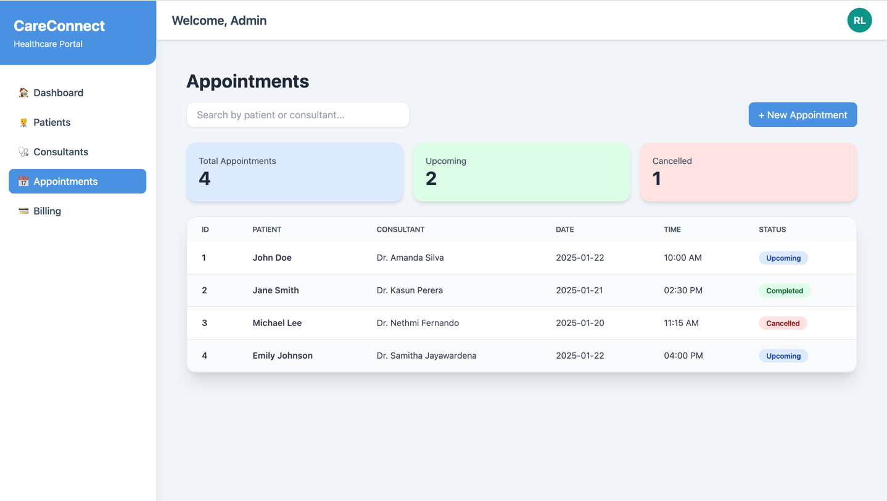
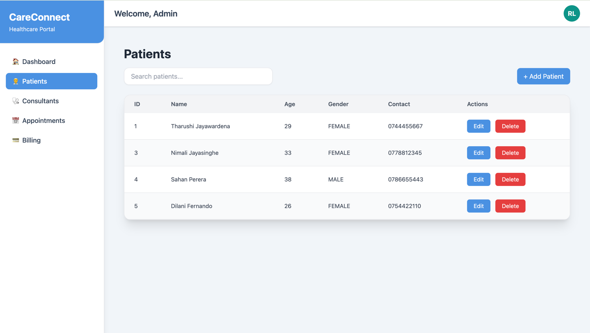
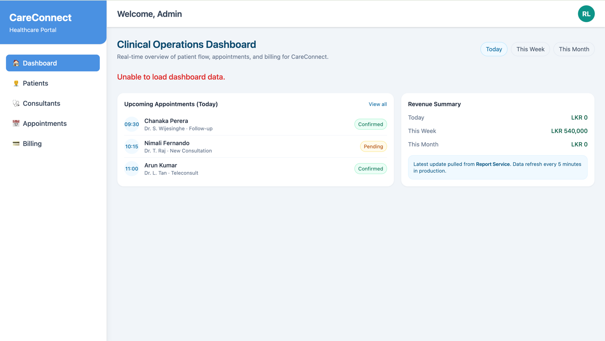

---

# 🏥 Care-Connect — Healthcare Management Platform

---

## High-Level Architecture Diagram

## Backend Architecture Diagram

# CareConnect Architecture Overview

CareConnect is a microservices-based healthcare management platform with:

- **Microfrontends** (React + Webpack Module Federation)
- **Backend Microservices** (Spring Boot)
- **Separate PostgreSQL databases per service**
- **API Gateway / Ingress Layer** for routing
- Room to extend to async messaging (Kafka/RabbitMQ) later.

## Frontend Microfrontends

- `care-connect-root-app`  
  Hosts layout, sidebar, topbar and routes to remotes.

- `care-connect-dashboard-app`  
  Dashboard with total patients, consultants, appointments, and revenue from `/api/v1/reports/dashboard`.

- `care-connect-patients-app`
    - CRUD for patients
    - Integrated with `patient-service` (`/api/v1/patients`)
    - Has modal for Add/Edit patient.

- `care-connect-consultants-app`
    - List + status of consultants
    - Integrated with `consultant-service` (`/api/v1/consultants`).

- `care-connect-appointments-app`
    - Shows appointments table
    - Summary: total, upcoming, cancelled
    - Create appointment modal (POST to `/api/v1/appointments`).

- `care-connect-payments-app`
    - Lists payments
    - Shows summary (paid, pending, failed)
    - Integrates with `payment-service` (`/api/v1/payments`).

## Backend Microservices

- `patient-service`
    - Manages patient entities
    - REST: `/api/v1/patients`
    - DB: `careconnect_patient_db`

- `consultant-service`
    - Manages consultants/providers
    - REST: `/api/v1/consultants`
    - DB: `careconnect_consultant_db`

- `appointment-service`
    - Schedules appointments
    - REST: `/api/v1/appointments`
    - DB: `careconnect_appointment_db`

- `payment-service`
    - Invoices and payments
    - REST: `/api/v1/payments`
    - DB: `careconnect_billing_db`

- `reports-service`
    - Aggregated metrics for dashboard
    - REST: `/api/v1/reports/dashboard`
    - Calls: `patient-service`, `consultant-service`, `appointment-service`, `payment-service`.

---
## 🏥 Care-Connect — Future Roadmap / TODO List

This document outlines all planned improvements for the Care-Connect Healthcare Platform, including frontend, backend, security, microservices patterns, performance, testing, and cloud infrastructure.

---

## ✅ 1. Frontend Improvements

### API Calls & State Management
- Integrate React Query or RTK Query for backend communication
- Add Redux Toolkit Store (global state)
- Add frontend caching (React Query cache + persistence)
- Add request retry logic
- Add global loading & error handlers

### UI/UX Enhancements
- Add protected routes
- Add role-based UI access
- Add skeleton loaders & progressive loading
- Add toast notification system
- Add pagination + infinite scrolling

---

## 🔐 2. Security Roadmap

### Authentication / Authorization
- Integrate Google Workspace (SAML / OIDC)
- Integrate Microsoft Azure AD (OIDC / OAuth2)
- Integrate AWS Cognito (Hosted UI + User Pool)
- Implement OIDC + OAuth2 token-based authentication

### Backend Security
- Implement Role-Based Authorization (RBAC) in Spring Boot
- Add Spring Boot Interceptors / Filters for token validation
- Implement JWT verification using RSA keys
- Apply BFF Pattern or API Gateway for token verification
- Add CORS Policies (restrict origins, methods, headers)
- Add Rate Limiting (Bucket4j / API Gateway throttling)
- Implement PKCE (Code Challenge + Verifier) for OAuth2
- Add input sanitization
  - Java: OWASP Java HTML Sanitizer
  - JavaScript: DOMPurify

### Frontend Security
- Protect sensitive routes
- Store tokens securely (prefer HTTP-Only Cookies)
- Add CSRF Protection
- Add Zod or Yup for form validation
- Add Helmet.js for HTTP header security

### Encryption
- Encrypt sensitive PII in database
- Use AWS KMS for encryption at rest
- Enforce HTTPS everywhere
- Add SSL Certificates (AWS ACM)

---

## 🚀 3. Performance Improvements

### Backend Optimizations
- Add Redis caching layer
- Implement @Cacheable with TTL
- Add database indexes for hot queries
- Avoid N+1 queries (JOIN FETCH / Entity Graphs)
- Add pagination to all list APIs
- Use DTO projections to reduce payload
- Reduce response payload size
- Enable GZIP compression
- Optimize async/thread pool settings

### Infrastructure Performance
- Keep server + DB in same region/zone
- Add CloudFront for frontend delivery
- Add ALB / API Gateway caching
- Enable autoscaling for ECS

---

## 🧩 4. Microservices Architecture Improvements

### Patterns
- Implement Saga Pattern for distributed transactions
- Add compensating rollback actions
- Add Circuit Breaker pattern (Resilience4j)
- Add API Gateway Pattern
- Add Service Registry (if using Spring Cloud)
- Implement Sidecar pattern for logs & monitoring
- Implement Event-Driven Architecture (SQS / Kafka)
- Add Dead Letter Queues (DLQ)

### Service-to-Service Communication
- Add Feign client timeouts + retries
- Add correlation IDs for distributed tracing
- Add OpenTelemetry for tracing & metrics

---

## 🧪 5. Testing Plan

### Backend Testing
- Unit tests with JUnit / TestNG + Mockito
- Integration tests with Spring Boot Test
- Contract tests (OpenAPI validation)
- Use Testcontainers for DB testing

### Frontend Testing
- Unit tests with Jest
- Component tests with React Testing Library
- E2E tests with Playwright or Selenium

### Performance Testing
- Load & Stress tests with JMeter
- API performance benchmarks
- Autoscaling tests

---

## ☁️ 6. AWS Cloud Infrastructure

### Security
- Enable AWS WAF for ALB
- Enable AWS Shield for DDoS protection
- Run all microservices in VPC private subnets
- Restrict security groups (least privilege)
- Enable CloudTrail + GuardDuty

### DevOps
- Use Terraform for all AWS resources
- Add CI/CD pipelines (Jenkins / GitHub Actions)
- Add automated rollbacks
- Implement Blue/Green deployments
- Implement Canary deployments (ECS/EKS)
- Add ArgoCD (if migrating to Kubernetes)

### Storage & Logs
- Enable CloudWatch Logs for services
- Set log retention policies
- Add S3 lifecycle rules

---

## 🧭 7. Documentation
- Create Architecture Diagram
- Create API Documentation (Swagger / OpenAPI)
- Create Deployment Diagram
- Document GitOps / CI/CD architecture
- Maintain a versioned TODO.md
- Maintain service contracts & schemas
- Add code comments for critical logic

---

## 🏁 8. Optional Future Features
- Push notifications
- Reporting dashboards
- AI doctor assistant
- Appointment reminders
- Payment gateway integration
- Multi-language support
- Multi-tenant support

